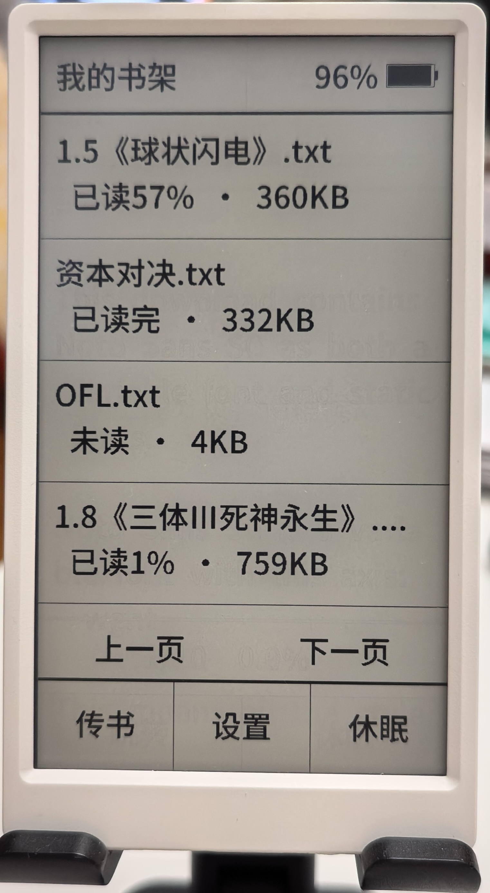
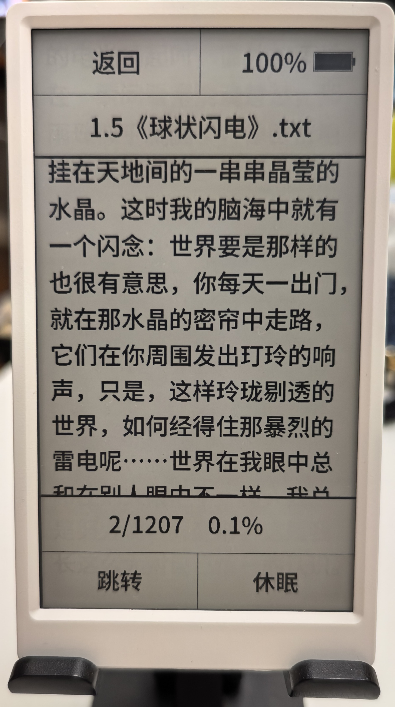
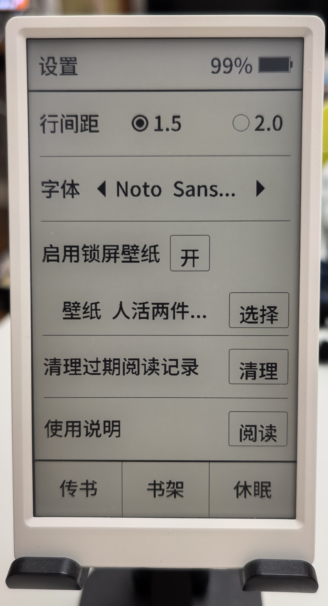
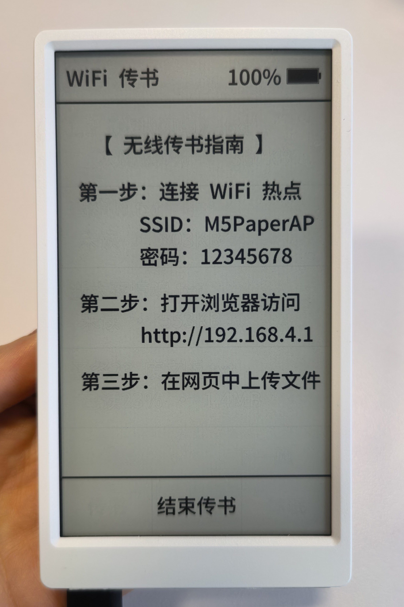
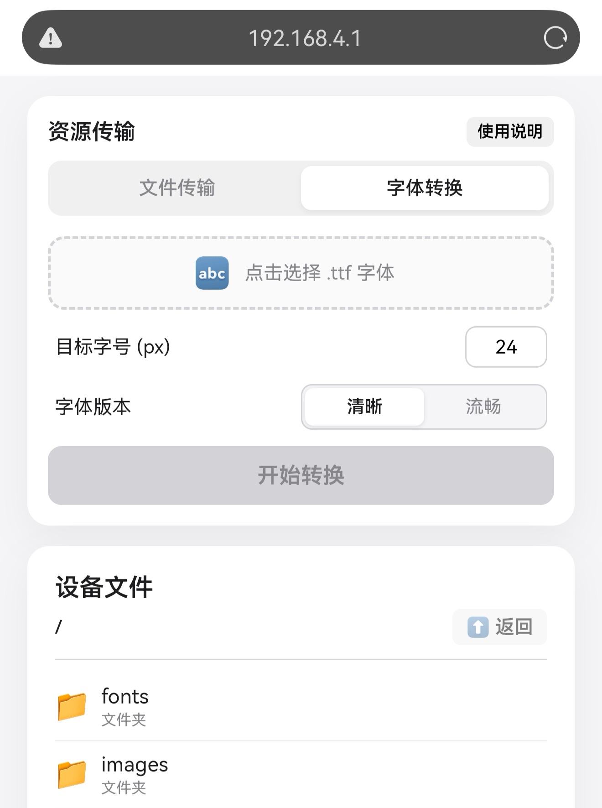
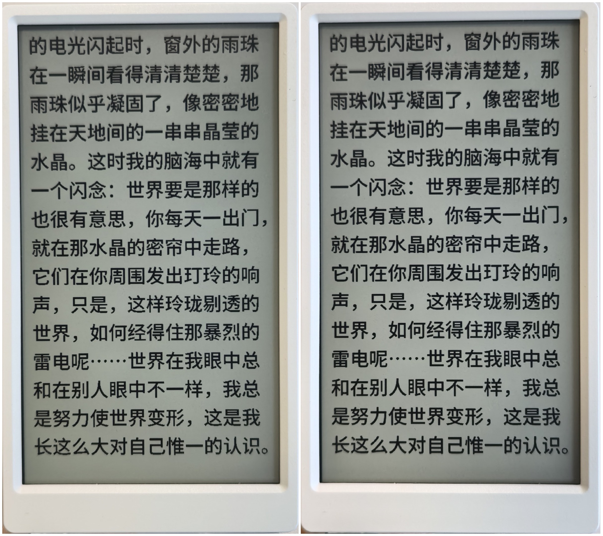

# M5Paper E-Ink Ebook Reader | M5Paper 电子书阅读器

[简体中文](#简体中文) | [English](#english)

---

<a name="简体中文"></a>
# 简体中文版本

一款适用于 **M5Paper v1 及 v1.1** (ESP32 + 电子纸墨水屏) 开发套件的基础中文 TXT 电子书阅读器。

本项目在墨水屏上实现了中文阅读功能，包含自定义字体渲染、后台分页索引、休眠壁纸选择，以及用于在局域网内传输书籍和字体的 Web 界面。

> [!NOTE]
> 本项目仅用于个人学习与探索。在开发过程中，使用了 AI 辅助进行设计、编写及调试，并参考了优秀的开源项目 [M5ReadPaper](https://github.com/shinemoon/M5ReadPaper)。

## 功能特性

*   **高对比度墨水屏界面**：包含电池图标、触控区域与局部刷新支持。
*   **中文文本支持**：
    *   支持 **UTF-8** 与 **GBK** 编码格式（自动转换）。
    *   实现针对中文排版与标点符号的换行处理。
*   **自定义字体系统**：
    *   支持解析由 `.ttf` 字体文件生成的自定义二进制字体格式（`.bin`）。
    *   **双字体渲染模式**：
        *   *流畅型 (Fluency)*：体积小，有锯齿。
        *   *清晰型 (Clarity)*：边缘抗锯齿处理，体积稍大。
    *   **字形缓存**：在 PSRAM 中缓存已加载的字形以降低翻页延迟。
    *   **内置 NotoSansSC 备用**：若外部 SD 卡字体文件缺失，系统退回到内置集成的 30px NotoSansSC 字体。
*   **阅读参数调节**：
    *   字号大小支持在 16px 到 40px 之间调整。
    *   行距支持 1.5 倍与 2.0 倍调节，并在小字号下调整了触控判定区域。
*   **分页与书签**：
    *   后台分页索引：将分页数据持久化为 SD 卡上的 `.idx` 文件以实现跳转。
    *   每本书均支持独立的书签添加与管理。
*   **Wi-Fi 无线传书与传字体 (Web UI)**：
    *   在书架页开启局域网热点，使用手机或电脑浏览器上传 `.txt` 电子书和 `.bin` 字体文件。
    *   网页端支持在上传前预览字体的实际渲染样式。
*   **电源与存储管理**：
    *   选择 SD 卡中的图片作为待机壁纸。
    *   深度睡眠支持（支持开机直达阅读界面）。
    *   清理阅读记录与缓存文件。

## 实物效果与截图

*以下为计划添加的实物图与界面展示占位符。未来可直接将对应图片文件放入 `docs/images/` 下即可自动加载：*

| 书架界面展示 | 阅读界面展示 | 设置页面展示 |
| :---: | :---: | :---: |
|  <br> *设备主页书架* |  <br> *设备阅读文本渲染* |  <br> *设备阅读参数调整* |

| 设备端传输界面 | 客户端传书网页 | 不同字体效果对比 |
| :---: | :---: | :---: |
|  <br> *设备开热点传书界面* |  <br> *浏览器端上传页面* |  <br> *流畅版 vs. 清晰版渲染对比* |

## 基本操作

阅读器支持通过屏幕触控和设备顶部的物理滚轮按键进行操作。

### 阅读页操作
*   **翻页（触控）**：点击屏幕左侧 1/3 区域为上一页，点击右侧 1/3 区域为下一页。
*   **翻页（滚轮）**：上下拨动物理滚轮进行翻页。
*   **清除残影**：向下按压物理滚轮键以进行全局刷新。
*   **唤出菜单**：点击屏幕中央 1/3 区域。

### 阅读菜单
*   **“返回”**：点击返回书架。
*   **“跳转”**：点击可输入页码或百分比进行精准跳转。
*   **关闭菜单**：点击屏幕中央的任意空白区域即可关闭菜单。

### 休眠与唤醒
*   **低功耗深度休眠**：在阅读菜单中点击底部右侧的 **休眠** 按钮可使设备立即进入深度休眠状态。
*   **设备唤醒**：向内长按物理滚轮键 **3 秒** 可唤醒设备。

### 书架页与其他通用操作
*   **书架**：显示 SD 卡 `/books` 目录下的书籍。点击书籍卡片即可开始阅读，最近一次阅读的书籍会自动排在书架首位。
*   **传书**：点击底部状态栏的 **传书** 按钮启动局域网热点，通过电脑或手机连接并访问屏幕提示的 IP 地址上传电子书。
*   **设置**：点击底部状态栏的 **设置** 按钮：
    *   *行间距*：支持在 1.5 倍与 2.0 倍之间切换（切换后会自动重新计算分页）。
    *   *清理过期阅读记录*：若手动删除了 `/books` 下的书籍，可在此一键清理对应的历史配置（.cfg）与分页索引（.idx）文件以释放空间。

## 快速上手

### 1. 前置准备
*   安装 **PlatformIO Core (命令行工具)**。您可以通过 pip 快速安装：
    ```bash
    pip install -U platformio
    ```
    *(其他安装方法请参考 [PlatformIO CLI 官方安装指南](https://docs.platformio.org/en/latest/core/installation/index.html))*
*   准备一张格式化为 FAT32 格式的 **Micro SD 卡** 插入 M5Paper。

### 2. 编译与烧录
1.  克隆或下载本项目，并进入项目根目录：
    ```bash
    git clone <repository_url>
    cd m5paper-ebook
    ```
2.  使用 USB-C 数据线将 M5Paper 连接至电脑。
3.  编译项目：
    ```bash
    pio run
    ```
4.  烧录固件至设备：
    ```bash
    pio run -t upload
    ```
5.  *(可选)* 开启串口监视器查看运行日志：
    ```bash
    pio device monitor
    ```

## 使用说明与文件管理

### SD 卡目录结构
为了确保阅读器正常读取，请插入格式化为 FAT32 的 SD 卡。
*   **自动创建**：系统会在首次开机时自动创建 `/configs` 目录。此外，当您**进入“WiFi 传书”页面**或上传文件时，系统会**自动创建 `/books`、`/fonts` 和 `/images` 目录**。
*   **手动拷贝**：如果您是通过电脑读卡器线下拷贝文件，则需要手动构建以下目录结构：

```text
SD Card/
├── books/                  # 存放您的 .txt 电子书（若通过读卡器拷贝，需手动创建该目录）
├── configs/                # 系统自动生成的全局配置文件、书籍分页索引（.idx）及书签
├── fonts/                  # 存放您自定义的二进制字体文件（.bin）
└── images/                 # 存放您的锁屏/休眠壁纸图片文件
```

### Wi-Fi 无线传书
1.  在书架页面，点击底部状态栏的 **“传书”** 按钮。
2.  M5Paper 将自动建立一个局域网 Wi-Fi 热点。请将您的手机或电脑连接至屏幕上显示的 Wi-Fi 名称。
3.  连接成功后，在手机/电脑的浏览器中输入屏幕上显示的 IP 地址（如 `http://192.168.4.1`）。
4.  在传书网页中，选择电脑中的 TXT 书籍或自定义生成的 `.bin` 字体文件直接进行上传。

### 自定义字体生成与转换
您可以使用项目自带的 Python 脚本，将 TrueType 字体（`.ttf`）转换成适合本设备读取的二进制 `.bin` 格式：
```bash
python tools/ttf2bin.py input_font.ttf output_font.bin
```
转换完成后，您可以**直接将生成的 `.bin` 字体文件拷贝至 SD 卡的 `/fonts` 目录下**，或者通过上述 **Wi-Fi 无线传书** 网页上传至设备，然后在设置页面中切换使用即可。

---

<a name="english"></a>
# English Version

A basic TXT ebook reader designed for the **M5Paper v1 and v1.1** (ESP32 + E-Ink) development kit.

This project provides a Chinese reading implementation on the e-paper screen, featuring custom font rendering, background pagination indexing, custom wallpaper selection, and a web-based interface for transferring books and fonts over Wi-Fi.

> [!NOTE]
> This project is solely for personal learning and exploration. During the development process, AI was used to assist with design, coding, and debugging, with reference to the excellent [M5ReadPaper](https://github.com/shinemoon/M5ReadPaper) project.

## Features

*   **E-paper Interface**: High-contrast E-paper interface with a battery indicator, touch targets, and partial refresh support.
*   **Chinese Text Support**:
    *   Support for **UTF-8** and **GBK** encodings (automatic conversion).
    *   Word wrapping and punctuation handling for Chinese characters.
*   **Custom Font Subsystem**:
    *   Renders custom binary font formats generated from `.ttf`.
    *   **Dual-Font Support**: Includes two preset rendering styles (configurable via the Web UI):
        *   *Fluency*: Smaller file size, faster loading, slightly aliased.
        *   *Clarity*: Antialiased, smooth curves, larger file size.
    *   **Font Caching**: Caches character glyphs in PSRAM to reduce page-turn latency.
    *   **NotoSansSC Fallback**: Falls back to the built-in NotoSansSC font if the external font file is missing.
*   **Reading Settings**:
    *   Adjustable font sizes (ranging from 16px to 40px).
    *   Adjustable line spacing (1.5x and 2.0x).
*   **Pagination & Bookmarks**:
    *   Background pagination indexing with cache saved as `.idx` files on the SD card.
    *   Add and manage bookmarks per book.
*   **Wi-Fi File Transfer (Web UI)**:
    *   Runs a local Web Server on M5Paper to upload `.txt` books and `.bin` fonts directly from your phone or computer.
    *   Select and preview font rendering styles ("Fluency" vs. "Clarity") right in the web browser before uploading.
*   **Power & Storage Management**:
    *   Wallpaper selection from images on the SD card.
    *   Deep sleep integration (with optional boot-straight-to-reading feature).
    *   Clearing reading records and cache.

## Demos & Physical Screenshots

*Below are placeholders for the planned physical photos showcasing the device and software. You can place corresponding images in `docs/images/` in the future to enable them:*

| Bookshelf Interface | Reading Interface | Settings Page |
| :---: | :---: | :---: |
|  <br> *Device bookshelf screen* |  <br> *Device reading rendering* |  <br> *Device settings adjustments* |

| Device Transfer Hotspot | Web Upload Client | Font Contrast Comparison |
| :---: | :---: | :---: |
|  <br> *Device hotspot info page* |  <br> *Web client upload page* |  <br> *Fluency vs. Clarity comparison* |

## Operations

The reader is operated via the touchscreen and the physical wheel button.

### Reading Page
*   **Page Turn (Touch)**: Tap the left 1/3 area of the screen to go to the previous page, and tap the right 1/3 area to go to the next page.
*   **Page Turn (Wheel)**: Scroll the physical wheel button up/down to flip pages.
*   **Clear Screen Ghosting**: Press down on the physical wheel button.
*   **Open Reading Menu**: Tap the center 1/3 area of the screen.

### Reading Menu
*   **Return**: Tap the button in the top-left corner to return to the Bookshelf.
*   **Jump**: Tap the button in the bottom-left corner to input a page number or percentage for precise jumping.
*   **Close Menu**: Tap any blank area in the middle of the screen to close the menu.

### Sleep & Wake
*   **Low-Power Sleep**: Tap the **Sleep** button in the bottom-right corner of the reading menu to enter deep sleep immediately.
*   **Wake Up Device**: Press and hold the physical wheel button inward for **3 seconds** to wake up.

### Bookshelf Page
*   **Book Selection**: Tap a book card to start reading. The most recently read book is automatically pinned to the top of the shelf.
*   **Wi-Fi Transfer**: Tap **Transfer** in the bottom navigation bar to start a local hotspot, then connect via phone/computer and visit the displayed IP address to upload books/fonts.
*   **Settings Page**: Tap **Settings** in the bottom navigation bar:
    *   *Line Spacing*: Switch between 1.5x and 2.0x (automatically re-paginates).
    *   *Clear Obsolete Progress*: One-click clearing of configurations (.cfg) and pagination indexes (.idx) for manually deleted books to free space.

## Getting Started

### 1. Prerequisites
*   Install **PlatformIO Core (CLI)**. You can install it via pip:
    ```bash
    pip install -U platformio
    ```
    *(For alternative installation methods, refer to [PlatformIO CLI Installation Guide](https://docs.platformio.org/en/latest/core/installation/index.html))*
*   An **SD Card** formatted to FAT32 inserted into the M5Paper.

## Build and Flash
1.  Clone or download this repository, and navigate to the project root:
    ```bash
    git clone <repository_url>
    cd m5paper-ebook
    ```
2.  Connect your M5Paper to your computer via a USB-C cable.
3.  Compile the project:
    ```bash
    pio run
    ```
4.  Upload the firmware to the device:
    ```bash
    pio run -t upload
    ```
5.  *(Optional)* Open the serial monitor to view logs:
    ```bash
    pio device monitor
    ```

## Usage & File Management

### SD Card Directory Structure
To ensure proper operation, insert a FAT32-formatted SD card. 
*   **Auto-generated**: The system automatically creates `/configs` on the first boot, and **automatically creates `/books`, `/fonts`, and `/images`** when you enter the "WiFi Transfer" page or upload files.
*   **Manual Copying**: If you are copying files offline via an SD card reader, you should manually prepare the following structure:

```text
SD Card/
├── books/                  # Place your .txt ebooks here (create manually if copying via PC card reader)
├── configs/                # Auto-generated global config, index files, and bookmarks
├── fonts/                  # Place your custom binary font (.bin) files here
└── images/                 # Place your lock screen wallpaper image files here
```

### Wi-Fi Book & Font Transfer
1.  From the Bookshelf page, tap **"Transfer"** in the bottom navigation bar.
2.  The M5Paper will start a local Wi-Fi hotspot. Connect your phone or computer to the Wi-Fi network displayed on the screen.
3.  Open your web browser and navigate to the URL shown on the M5Paper display (e.g., `http://192.168.4.1`).
4.  Use the web interface to upload your TXT books or custom binary font files.

### Converting Custom Fonts
You can convert TrueType fonts (`.ttf`) into the custom binary format compatible with this reader:
```bash
python tools/ttf2bin.py input_font.ttf output_font.bin
```
Once converted, you can **directly copy the `.bin` font file to the `/fonts` directory on your SD card**, or upload it via the Wi-Fi Transfer web interface, then select it in the Settings page.
